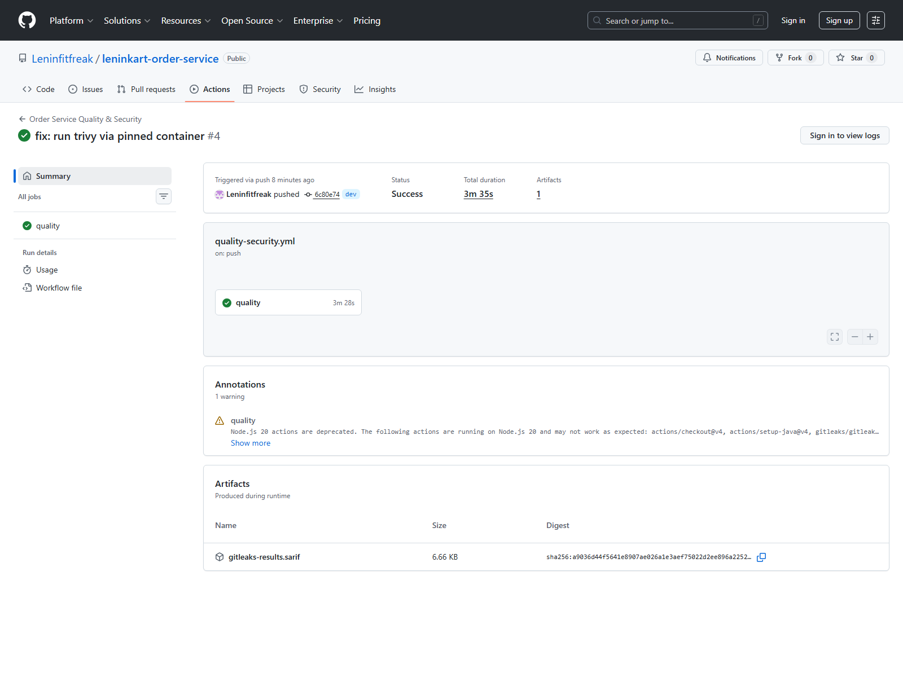
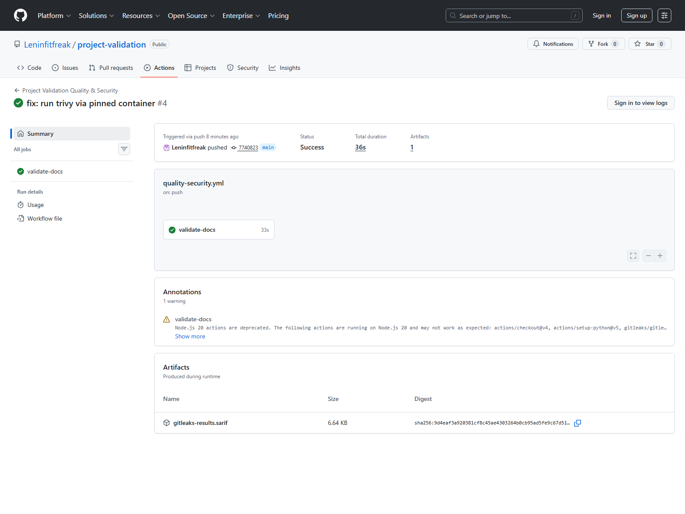
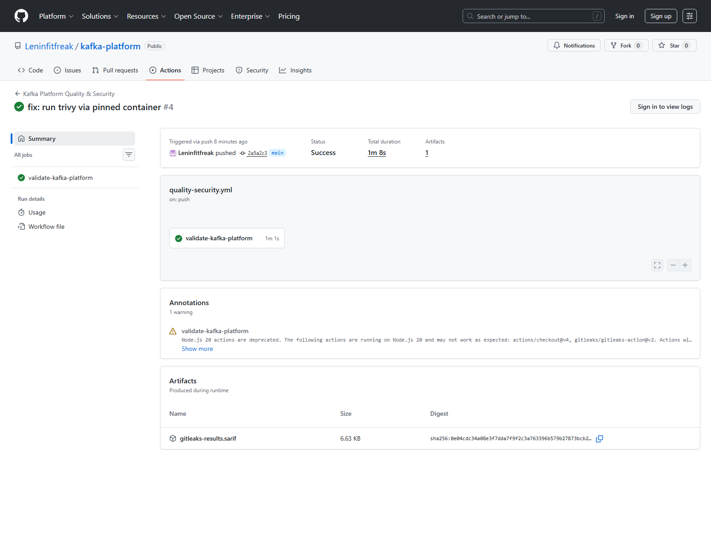

# CI Validation Report

## Summary

The LeninKart platform now has a practical CI/DevSecOps baseline across the active repositories.

Implemented areas:

- build/test validation
- secret scanning
- vulnerability/config/image scanning
- documentation-ready public workflow structure

## Latest Corrected Public Runs

Only the latest post-fix runs are counted as final evidence:

| Repo | Workflow | Status | Run |
| --- | --- | --- | --- |
| `leninkart-frontend` | Frontend Quality & Security | Success | [#4](https://github.com/Leninfitfreak/leninkart-frontend/actions/runs/23599512037) |
| `leninkart-product-service` | Product Service Quality & Security | Success | [#3](https://github.com/Leninfitfreak/leninkart-product-service/actions/runs/23599512416) |
| `leninkart-order-service` | Order Service Quality & Security | Success | [#3](https://github.com/Leninfitfreak/leninkart-order-service/actions/runs/23599512566) |
| `leninkart-infra` | Infra Quality & Security | Success | [#8](https://github.com/Leninfitfreak/leninkart-infra/actions/runs/23599611267) |
| `project-validation` | Project Validation Quality & Security | Success | [#3](https://github.com/Leninfitfreak/project-validation/actions/runs/23599514246) |
| `kafka-platform` | Kafka Platform Quality & Security | Success | [#4](https://github.com/Leninfitfreak/kafka-platform/actions/runs/23599513549) |

Earlier failed runs caused by the unstable Trivy action wrapper were intentionally excluded from the final proof set.

## Locally Verified Commands

- `leninkart-frontend`
  - `npm.cmd install`
  - `npm.cmd test -- --runInBand`
  - `npm.cmd run build`
- `leninkart-infra`
  - `helm lint applications/frontend/helm`
  - `helm lint applications/product-service/helm --values applications/product-service/helm/values-dev.yaml`
  - `helm lint applications/order-service/helm --values applications/order-service/helm/values-dev.yaml`
- `project-validation`
  - `python -m compileall validation run_validation.py`
  - `python -m mkdocs build`
- `kafka-platform`
  - `docker compose -f docker-compose.yml config`

## Locally Blocked By Toolchain, Not Repo Defects

- `leninkart-product-service`
  - blocked by missing local Maven and stopped Docker daemon
- `leninkart-order-service`
  - blocked by missing local Maven and stopped Docker daemon
- image build verification in Docker-backed repos
  - blocked by stopped Docker daemon

## Fixes Applied During Validation

- frontend test path made stable for CRA/Jest by:
  - guarding the runtime root mount in tests
  - mocking `axios` for the shell-level test
- infra Helm lint workflow updated to use env values files for service charts
- Trivy scanning moved from the GitHub Action wrapper to pinned `aquasec/trivy:0.65.0` container commands for a more stable, portfolio-friendly baseline

## Public CI Evidence

### Frontend Workflow Summary

### Frontend Job Detail

This job page shows the concrete proof points required for portfolio review:

- frontend tests
- frontend build
- `Gitleaks` secret scan
- Trivy filesystem scan
- Trivy image scan

### Additional Successful Workflow Summaries

## Notes

- GitHub still shows a non-blocking Node 20 deprecation warning for some third-party actions.
- That warning does not invalidate the latest success runs, but it should be addressed in a future maintenance pass.
