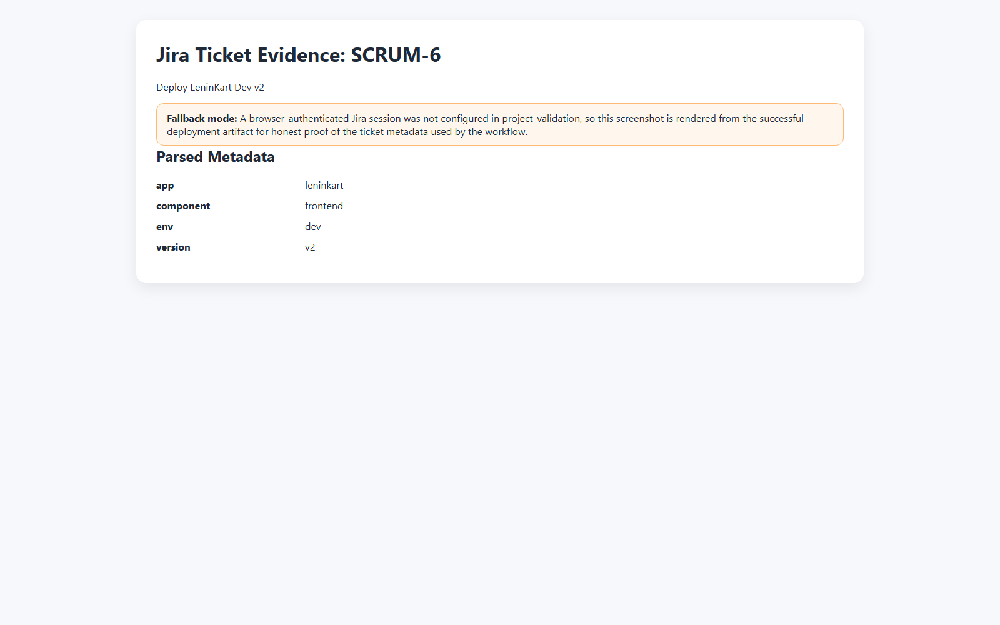
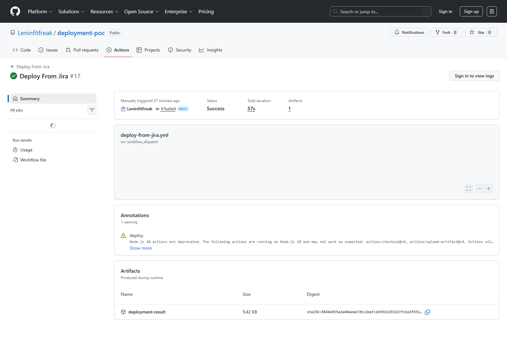
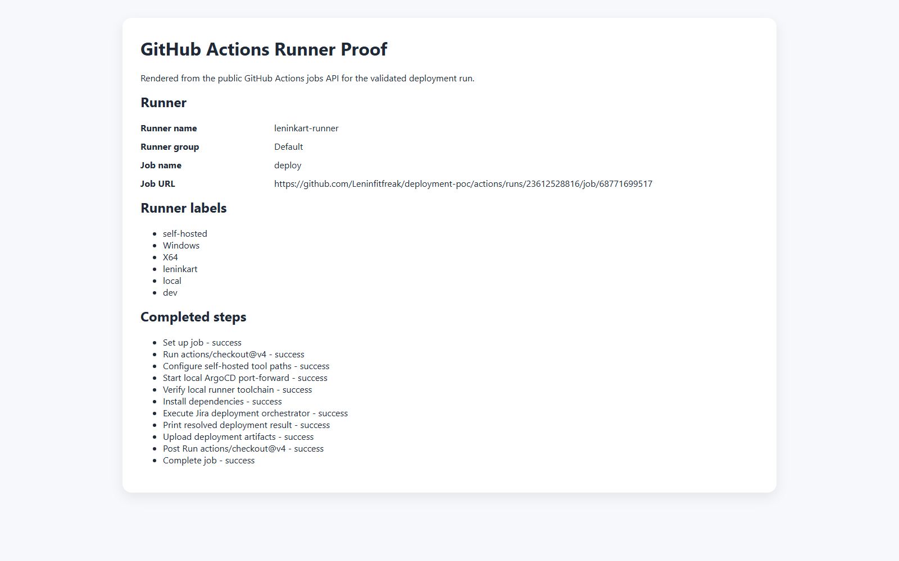
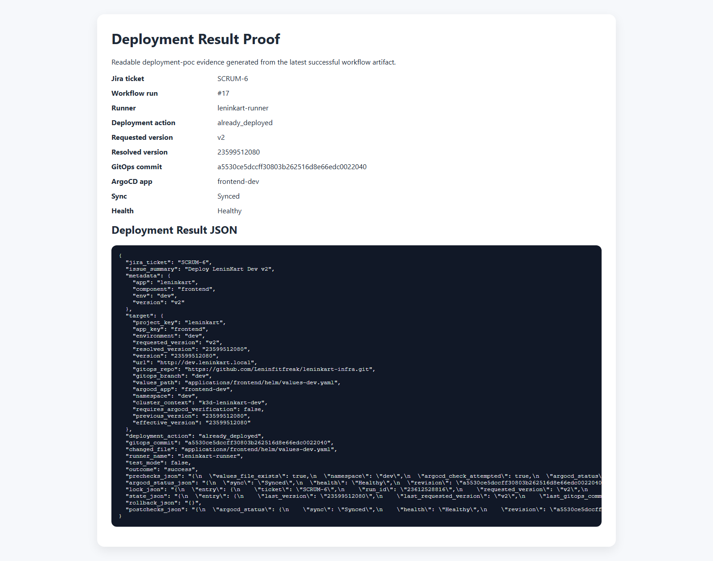
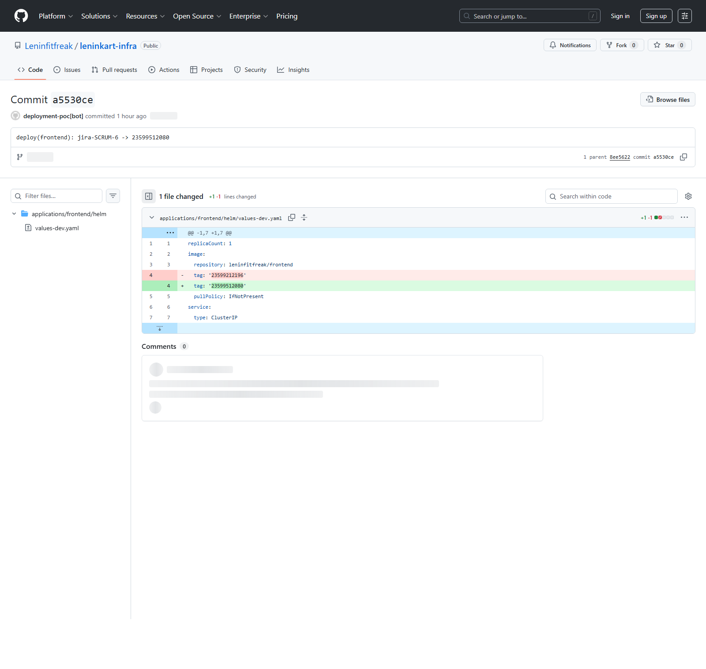
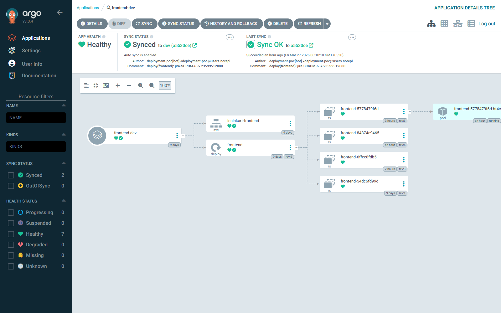

# Deployment POC Evidence Index

## `DEP-001` Jira ticket proof

- Status: `PASS`
- Detail: Deployment ticket proof captured from the live Jira page or an honest artifact-backed fallback
- Screenshot: [screenshots/deployment/jira-ticket-proof.png](screenshots/deployment/jira-ticket-proof.png)

## `DEP-002` GitHub Actions deployment run summary

- Status: `PASS`
- Detail: Public workflow run summary loaded with successful deployment job visible
- Screenshot: [screenshots/deployment/github-actions-run-summary.png](screenshots/deployment/github-actions-run-summary.png)

## `DEP-003` GitHub Actions runner proof

- Status: `PASS`
- Detail: Readable runner proof confirms the validated deployment run used the expected self-hosted runner and labels
- Screenshot: [screenshots/deployment/github-actions-runner-proof.png](screenshots/deployment/github-actions-runner-proof.png)

- Artifact: `artifacts/deployment-poc/github-actions-runner-proof.html`

## `DEP-004` deployment-poc result proof

- Status: `PASS`
- Detail: Readable deployment result artifact rendered with ticket, action, commit, and ArgoCD details
- Screenshot: [screenshots/deployment/deployment-result-proof.png](screenshots/deployment/deployment-result-proof.png)

- Artifact: `artifacts/deployment-poc/deployment-result-proof.html`

## `DEP-005` GitOps commit proof

- Status: `PASS`
- Detail: Public GitHub commit page shows the relevant leninkart-infra revision and target values file path
- Screenshot: [screenshots/deployment/gitops-commit-proof.png](screenshots/deployment/gitops-commit-proof.png)

## `DEP-006` ArgoCD deployment application proof

- Status: `PASS`
- Detail: ArgoCD application detail shows the validated app as Synced and Healthy on the expected revision
- Screenshot: [screenshots/deployment/argocd-deployment-app.png](screenshots/deployment/argocd-deployment-app.png)

