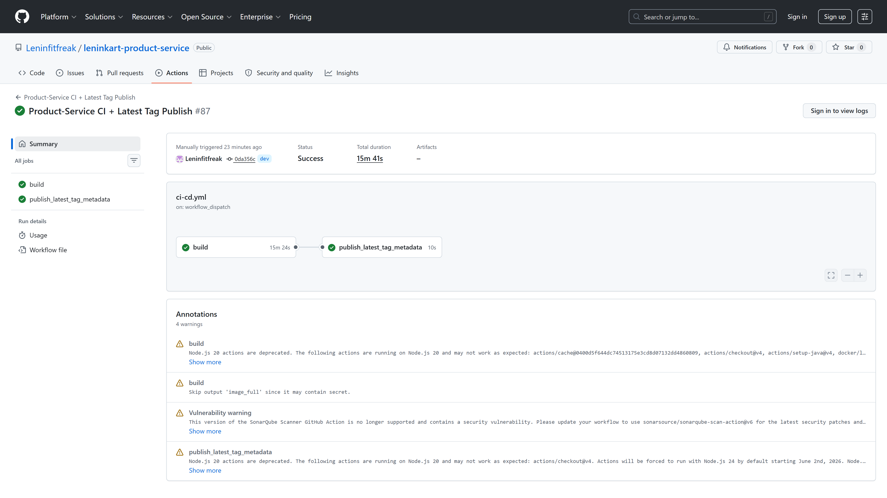
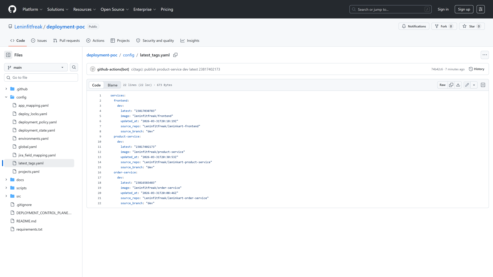

# Deployment POC Validation Report

## Validated Scope

- Service CI latest-tag publish proof
- latest_tags.yaml metadata proof
- Jira issue browser proof when available
- GitHub Actions workflow summary and self-hosted runner proof
- deployment-poc result proof from the real GitHub workflow artifact section
- GitOps commit and target file proof
- ArgoCD final Sync and Health proof
- Application reachability proof

## Latest Validated Deployment

- Jira ticket: `SCRUM-42`
- Jira ticket URL: `https://leninkart.atlassian.net/browse/SCRUM-42`
- Jira final status: `Done`
- Jira comments captured: `10`
- Jira progress stages: `workflow_triggered, jira_validated, target_resolved, lock_acquired, gitops_commit_pushed, argocd_sync_started, argocd_synced_healthy, post_checks_completed, completed`
- Workflow run: `#65`
- Workflow URL: `https://github.com/Leninfitfreak/deployment-poc/actions/runs/23818019006`
- Runner: `leninkar-runner`
- Deployment action: `deployed`
- Requested version: `latest-dev`
- Resolved version: `23817402173`
- Version source: `latest_tag_metadata`
- Version reference: `latest-dev`
- Image repository: `leninfitfreak/product-service`
- latest_tags file: `config/latest_tags.yaml`
- latest_tags value: `23817402173`
- latest_tags updated at: `2026-03-31T20:30:53Z`
- latest_tags source repo: `Leninfitfreak/leninkart-product-service`
- latest_tags source branch: `dev`
- Expected fresh latest-tag service: `product-service`
- Expected fresh latest-tag value: `23817402173`
- Expected latest-tag match: `True`
- GitOps commit: `bce8c2523ebd01901d9a33cd029a8099b3f388b4`
- GitOps values path: `applications/product-service/helm/values-dev.yaml`
- ArgoCD app: `dev-product-service`
- Final sync: `Synced`
- Final health: `Healthy`
- Service CI proof run: `https://github.com/Leninfitfreak/leninkart-product-service/actions/runs/23817402173`
- Service CI metadata contract: `True`
- Fresh orchestration context: `{'target_app': 'product-service', 'environment': 'dev', 'requested_version': 'latest-dev', 'service_ci_run_id': 23817402173, 'service_ci_run_url': 'https://github.com/Leninfitfreak/leninkart-product-service/actions/runs/23817402173', 'jira_ticket': {'key': 'SCRUM-42', 'url': 'https://leninkart.atlassian.net/browse/SCRUM-42', 'summary': 'Auto Validation - product-service latest-dev deployment', 'description': 'app: product-service\nenv: dev\nversion: latest-dev\ncomponent: backend\nreason: automated end-to-end platform validation', 'status_name': 'To Do'}}`
- Jira UI status: `SKIPPED`
- Supporting artifact: `github-actions://Leninfitfreak/deployment-poc/runs/23818019006/artifacts/6208205962`

## Screenshot Proof

### DEP-001 Service CI latest tag publish proof

- Detail: Real GitHub Actions run page shows the service CI workflow that published the latest tag metadata used by deployment-poc.
- Screenshot: [screenshots/deployment/service-ci-latest-tag-publish.png](screenshots/deployment/service-ci-latest-tag-publish.png)

### DEP-001A Latest tag metadata proof

- Detail: Real GitHub file page shows the latest_tags entry that deployment-poc resolved for this deployment.
- Screenshot: [screenshots/deployment/latest-tags-metadata-proof.png](screenshots/deployment/latest-tags-metadata-proof.png)

### DEP-002 GitHub Actions deployment run summary

- Detail: Real GitHub Actions workflow run page captured with job summary visible
- Screenshot: [screenshots/deployment/github-actions-run-summary.png](screenshots/deployment/github-actions-run-summary.png)

### DEP-003 GitHub Actions runner proof

- Detail: Real GitHub job page captured with the self-hosted runner details visible
- Screenshot: [screenshots/deployment/github-actions-runner-proof.png](screenshots/deployment/github-actions-runner-proof.png)

### DEP-004 deployment-poc result proof

- Detail: Real GitHub workflow run page captured with the deployment-result artifact visible as primary browser proof
- Screenshot: [screenshots/deployment/deployment-result-proof.png](screenshots/deployment/deployment-result-proof.png)

### DEP-005 GitOps commit proof

- Detail: Real public GitHub commit page shows the leninkart-infra revision and changed values file
- Screenshot: [screenshots/deployment/gitops-commit-proof.png](screenshots/deployment/gitops-commit-proof.png)

### DEP-006 ArgoCD deployment application proof

- Detail: Real ArgoCD application page shows Synced and Healthy on the expected revision
- Screenshot: [screenshots/deployment/argocd-deployment-app.png](screenshots/deployment/argocd-deployment-app.png)

### DEP-007 Application deployment proof

- Detail: Real browser screenshot confirms the deployed LeninKart application is reachable
- Screenshot: [screenshots/deployment/application-home-proof.png](screenshots/deployment/application-home-proof.png)

## Warnings

- Jira browser UI proof was skipped by configuration for this validation run.

## Evidence Model

- Primary proof in this report is browser-captured UI.
- Local artifacts are supporting evidence only.

## Final Verdict

`PASS_WITH_WARNINGS`
