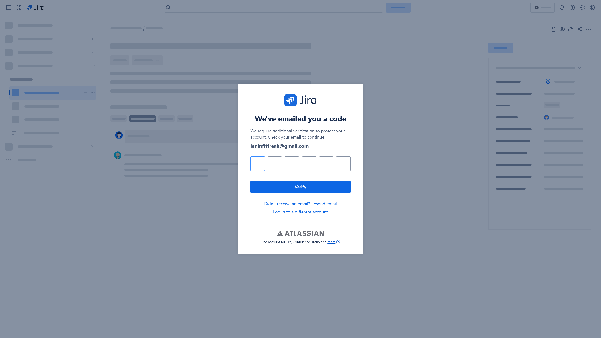

# Deployment POC Validation Report

## Validated Scope

- Jira deployment ticket proof
- GitHub Actions workflow summary and self-hosted runner proof
- deployment-poc result proof from the real GitHub workflow artifact section
- GitOps commit and target file proof
- ArgoCD final Sync and Health proof
- Application reachability proof

## Latest Validated Deployment

- Jira ticket: `SCRUM-23`
- Workflow run: `#46`
- Workflow URL: `https://github.com/Leninfitfreak/deployment-poc/actions/runs/23683946292`
- Runner: `leninkar-runner`
- Deployment action: `deployed`
- Requested version: `v1`
- Resolved version: `23599211809`
- GitOps commit: `67f00d07fdbfa49c6db4dc12dbfb5cbd7684b412`
- GitOps values path: `applications/product-service/helm/values-dev.yaml`
- ArgoCD app: `dev-product-service`
- Final sync: `Synced`
- Final health: `Healthy`
- Jira proof mode: `mfa_challenge`
- Supporting artifact: `github-actions://Leninfitfreak/deployment-poc/runs/23683946292/artifacts/6158238385`

## Screenshot Proof

### DEP-001 Jira ticket proof

- Detail: Jira browser navigation succeeded through the hosted Atlassian login, but the session stopped on the emailed MFA challenge page before the ticket UI could be opened.
- Screenshot: [screenshots/jira/jira-login-challenge.png](screenshots/jira/jira-login-challenge.png)

### DEP-002 GitHub Actions deployment run summary

- Detail: Real GitHub Actions workflow run page captured with job summary visible
- Screenshot: [screenshots/deployment/github-actions-run-summary.png](screenshots/deployment/github-actions-run-summary.png)

### DEP-003 GitHub Actions runner proof

- Detail: Real GitHub job page captured with the self-hosted runner details visible
- Screenshot: [screenshots/deployment/github-actions-runner-proof.png](screenshots/deployment/github-actions-runner-proof.png)

### DEP-004 deployment-poc result proof

- Detail: Real GitHub workflow run page captured with the deployment-result artifact visible as primary browser proof
- Screenshot: [screenshots/deployment/deployment-result-proof.png](screenshots/deployment/deployment-result-proof.png)

### DEP-005 GitOps commit proof

- Detail: Real public GitHub commit page shows the leninkart-infra revision and changed values file
- Screenshot: [screenshots/deployment/gitops-commit-proof.png](screenshots/deployment/gitops-commit-proof.png)

### DEP-006 ArgoCD deployment application proof

- Detail: Real ArgoCD application page shows Synced and Healthy on the expected revision
- Screenshot: [screenshots/deployment/argocd-deployment-app.png](screenshots/deployment/argocd-deployment-app.png)

### DEP-007 Application deployment proof

- Detail: Real browser screenshot confirms the deployed LeninKart application is reachable
- Screenshot: [screenshots/deployment/application-home-proof.png](screenshots/deployment/application-home-proof.png)

## Warnings

- Jira page automation reached Atlassian MFA, but automated OTP retrieval is still blocked by Gmail security. IMAP requires an app password, and browser automation is rejected as an insecure sign-in, so the final ticket UI could not be captured yet.

## Evidence Model

- Primary proof in this report is browser-captured UI.
- Local artifacts are supporting evidence only.

## Final Verdict

`PASS_WITH_WARNINGS`
