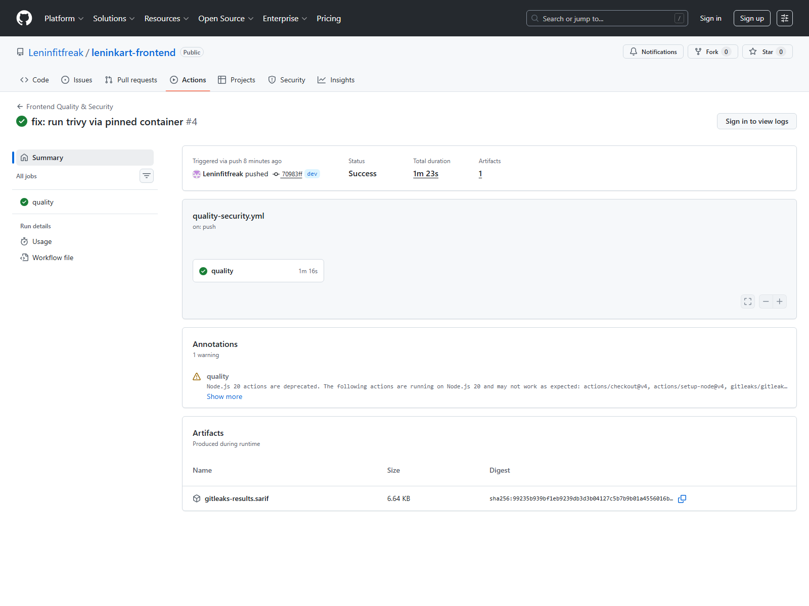
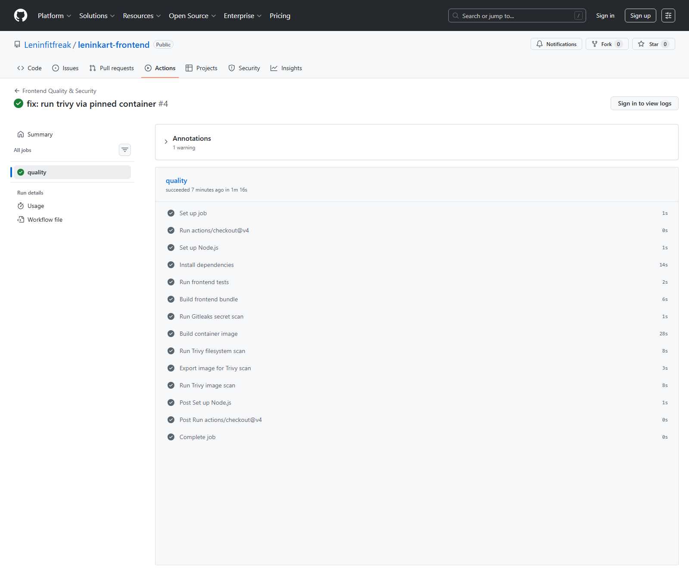
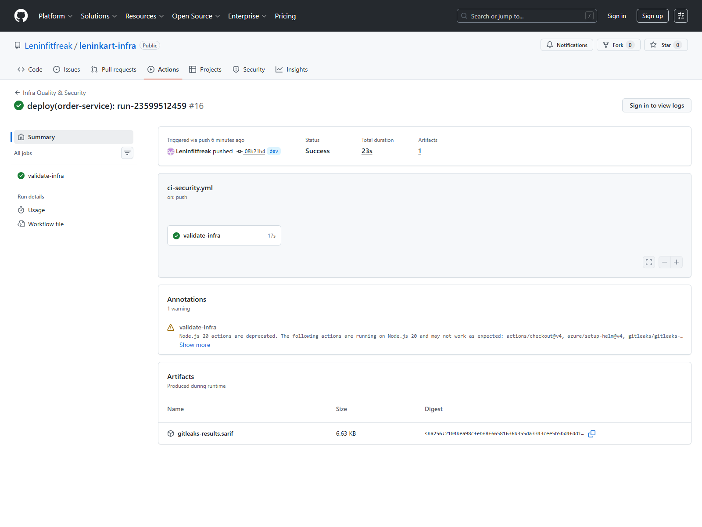

# DevSecOps Summary

## Outcome

The LeninKart platform now includes a practical CI/DevSecOps layer designed for:

- portfolio proof
- GitHub visibility
- interview discussion
- day-to-day repository hygiene

## Included Controls

- automated build/test validation
- secret scanning with `Gitleaks`
- vulnerability/config/image scanning with pinned `Trivy` container commands
- infra linting with `Helm`
- docs build verification for `project-validation`
- compose syntax validation for `kafka-platform`

## Why This Is Practical

- small enough to maintain
- strong enough to demonstrate real engineering discipline
- avoids heavy enterprise-only complexity
- produces clean public workflow pages that can be used as evidence

## Current Limitations

- local workstation lacks Maven
- local Docker daemon is currently unavailable
- GitHub still emits a non-blocking Node 20 deprecation warning for some marketplace actions

## Final Proof Snapshot

The final CI evidence set now includes successful public GitHub Actions runs for:

- frontend quality/security
- product-service quality/security
- order-service quality/security
- infra quality/security
- project-validation quality/security
- kafka-platform quality/security

Representative screenshots:

- 
- 
- 
