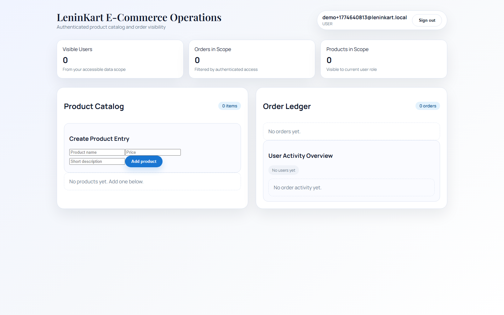

# Platform Evidence Index

## `INF-001` Kubernetes inventory artifacts

- Category: `infra`
- Status: `PASS`
- Proof: Pod, service, ingress, ArgoCD app, and ExternalSecret outputs captured
- Artifact: `artifacts/kubernetes-pod-inventory.txt`

## `MSG-001` Kafka runtime health

- Category: `messaging`
- Status: `PASS`
- Proof: Docker runtime proof captured for external Kafka
- Artifact: `artifacts/kafka-runtime-health.txt`

## `MSG-002` Kafka dashboard proof

- Category: `messaging`
- Status: `PASS`
- Proof: Kafka dashboard screenshot will be produced during observability validation
- Screenshot: [screenshots/messaging/kafka-dashboard.png](screenshots/messaging/kafka-dashboard.png)

## `APP-001` Frontend login page

- Category: `application`
- Status: `PASS`
- Proof: Login page visible
- Screenshot: [screenshots/application/frontend-login.png](screenshots/application/frontend-login.png)

## `APP-002` Frontend signup page

- Category: `application`
- Status: `PASS`
- Proof: Signup form visible
- Screenshot: [screenshots/application/frontend-signup.png](screenshots/application/frontend-signup.png)

## `APP-003` Signup success state

- Category: `application`
- Status: `PASS`
- Proof: Signup success notice visible
- Screenshot: [screenshots/application/frontend-signup-success.png](screenshots/application/frontend-signup-success.png)

## `APP-004` Authenticated dashboard

- Category: `application`
- Status: `PASS`
- Proof: Dashboard fully visible
- Screenshot: [screenshots/application/frontend-dashboard.png](screenshots/application/frontend-dashboard.png)

## `APP-005` Product creation form

- Category: `application`
- Status: `PASS`
- Proof: Filled product form captured
- Screenshot: [screenshots/application/product-form.png](screenshots/application/product-form.png)

## `APP-006` Product list with created items

- Category: `application`
- Status: `PASS`
- Proof: Created products visible in list
- Screenshot: [screenshots/application/product-list.png](screenshots/application/product-list.png)

## `APP-007` Order ledger populated

- Category: `application`
- Status: `PASS`
- Proof: Order row visible after buy flow
- Screenshot: [screenshots/application/order-ledger.png](screenshots/application/order-ledger.png)

## `APP-008` User activity overview

- Category: `application`
- Status: `PASS`
- Proof: User activity panel visible
- Screenshot: [screenshots/application/user-activity.png](screenshots/application/user-activity.png)

## `GIT-001` ArgoCD login page

- Category: `gitops`
- Status: `PASS`
- Proof: ArgoCD login visible
- Screenshot: [screenshots/gitops/argocd-login.png](screenshots/gitops/argocd-login.png)

## `GIT-002` ArgoCD applications list

- Category: `gitops`
- Status: `PASS`
- Proof: Core app names visible
- Screenshot: [screenshots/gitops/argocd-app-list.png](screenshots/gitops/argocd-app-list.png)

## `GIT-003` ArgoCD app detail

- Category: `gitops`
- Status: `PASS`
- Proof: Selected app detail visible
- Screenshot: [screenshots/gitops/argocd-app-detail.png](screenshots/gitops/argocd-app-detail.png)

## `DEP-001` Jira ticket proof

- Category: `deployment`
- Status: `WARN`
- Proof: Real Jira UI proof is not configured in project-validation; no synthetic fallback was used as primary evidence

## `DEP-002` GitHub Actions deployment run summary

- Category: `deployment`
- Status: `PASS`
- Proof: Real GitHub Actions workflow run page captured with job summary visible
- Screenshot: [screenshots/deployment/github-actions-run-summary.png](screenshots/deployment/github-actions-run-summary.png)

## `DEP-003` GitHub Actions runner proof

- Category: `deployment`
- Status: `PASS`
- Proof: Real GitHub job page captured with the self-hosted runner details visible
- Screenshot: [screenshots/deployment/github-actions-runner-proof.png](screenshots/deployment/github-actions-runner-proof.png)

## `DEP-004` deployment-poc result proof

- Category: `deployment`
- Status: `PASS`
- Proof: Real GitHub workflow run page captured with the deployment-result artifact visible as primary browser proof
- Screenshot: [screenshots/deployment/deployment-result-proof.png](screenshots/deployment/deployment-result-proof.png)

## `DEP-005` GitOps commit proof

- Category: `deployment`
- Status: `PASS`
- Proof: Real public GitHub commit page shows the leninkart-infra revision and changed values file
- Screenshot: [screenshots/deployment/gitops-commit-proof.png](screenshots/deployment/gitops-commit-proof.png)

## `DEP-006` ArgoCD deployment application proof

- Category: `deployment`
- Status: `PASS`
- Proof: Real ArgoCD application page shows Synced and Healthy on the expected revision
- Screenshot: [screenshots/deployment/argocd-deployment-app.png](screenshots/deployment/argocd-deployment-app.png)

## `DEP-007` Application deployment proof

- Category: `deployment`
- Status: `PASS`
- Proof: Real browser screenshot confirms the deployed LeninKart application is reachable
- Screenshot: [screenshots/deployment/application-home-proof.png](screenshots/deployment/application-home-proof.png)

## `SEC-001` Vault login page

- Category: `secrets`
- Status: `PASS`
- Proof: Vault login visible
- Screenshot: [screenshots/secrets/vault-login.png](screenshots/secrets/vault-login.png)

## `SEC-002` Vault safe inventory view

- Category: `secrets`
- Status: `PASS`
- Proof: Vault secret engines view visible
- Screenshot: [screenshots/secrets/vault-secret-inventory.png](screenshots/secrets/vault-secret-inventory.png)

## `SEC-003` Vault secret proof artifact

- Category: `secrets`
- Status: `PASS`
- Proof: Safe secret-path proof written
- Artifact: `artifacts/vault-secret-proof.md`

## `OBS-001` Grafana login

- Category: `observability`
- Status: `PASS`
- Proof: Grafana login page visible
- Screenshot: [screenshots/observability/grafana-login.png](screenshots/observability/grafana-login.png)

## `OBS-002` Grafana dashboard list

- Category: `observability`
- Status: `PASS`
- Proof: Provisioned dashboard list visible inside the LeninKart folder
- Screenshot: [screenshots/observability/grafana-dashboard-list.png](screenshots/observability/grafana-dashboard-list.png)

## `OBS-003` LeninKart Platform Overview

- Category: `observability`
- Status: `PASS`
- Proof: LeninKart Platform Overview rendered with visible content
- Screenshot: [screenshots/observability/dashboard-platform.png](screenshots/observability/dashboard-platform.png)

## `OBS-004` LeninKart Product Service Overview

- Category: `observability`
- Status: `PASS`
- Proof: LeninKart Product Service Overview rendered with visible content
- Screenshot: [screenshots/observability/dashboard-product.png](screenshots/observability/dashboard-product.png)

## `OBS-005` LeninKart Order Service Overview

- Category: `observability`
- Status: `PASS`
- Proof: LeninKart Order Service Overview rendered with visible content
- Screenshot: [screenshots/observability/dashboard-order.png](screenshots/observability/dashboard-order.png)

## `OBS-006` LeninKart Frontend Overview

- Category: `observability`
- Status: `PASS`
- Proof: LeninKart Frontend Overview rendered with visible content
- Screenshot: [screenshots/observability/dashboard-frontend.png](screenshots/observability/dashboard-frontend.png)

## `OBS-007` LeninKart Logs Overview

- Category: `observability`
- Status: `PASS`
- Proof: LeninKart Logs Overview rendered with visible content
- Screenshot: [screenshots/observability/dashboard-logs.png](screenshots/observability/dashboard-logs.png)

## `OBS-008` LeninKart Kafka Overview

- Category: `observability`
- Status: `PASS`
- Proof: LeninKart Kafka Overview rendered with visible content
- Screenshot: [screenshots/observability/dashboard-kafka.png](screenshots/observability/dashboard-kafka.png)

## `OBS-009` Grafana Explore Loki

- Category: `observability`
- Status: `PASS`
- Proof: Loki search returned recent product-service logs
- Screenshot: [screenshots/observability/grafana-loki-explore.png](screenshots/observability/grafana-loki-explore.png)

## `OBS-010` Prometheus targets

- Category: `observability`
- Status: `PASS`
- Proof: Prometheus targets page populated
- Screenshot: [screenshots/observability/prometheus-targets.png](screenshots/observability/prometheus-targets.png)

## `OBS-011` Grafana Tempo datasource

- Category: `observability`
- Status: `PASS`
- Proof: Tempo datasource page visible
- Screenshot: [screenshots/observability/grafana-tempo-datasource.png](screenshots/observability/grafana-tempo-datasource.png)

## `OBS-012` Tempo search results

- Category: `observability`
- Status: `PASS`
- Proof: Tempo search returned product-service traces
- Screenshot: [screenshots/observability/tempo-search.png](screenshots/observability/tempo-search.png)

## `OBS-013` Product trace detail

- Category: `observability`
- Status: `PASS`
- Proof: Product-service trace detail visible
- Screenshot: [screenshots/observability/tempo-product-trace.png](screenshots/observability/tempo-product-trace.png)

## `OBS-014` Order trace detail

- Category: `observability`
- Status: `PASS`
- Proof: Order-service trace detail visible
- Screenshot: [screenshots/observability/tempo-order-trace.png](screenshots/observability/tempo-order-trace.png)

