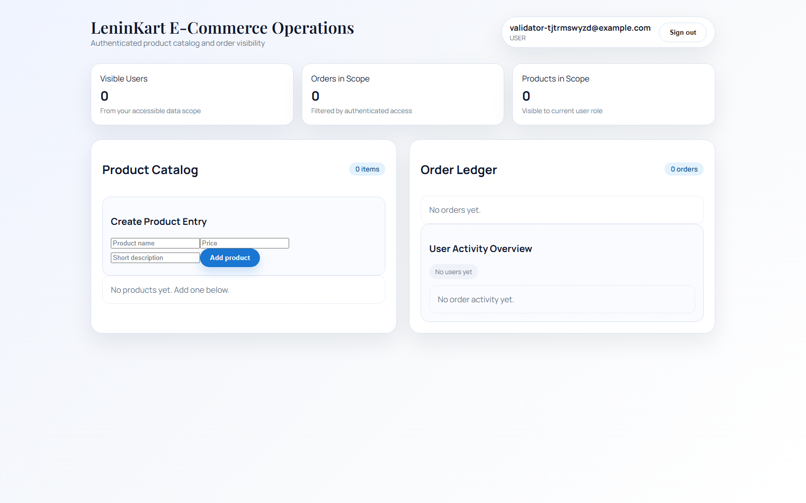
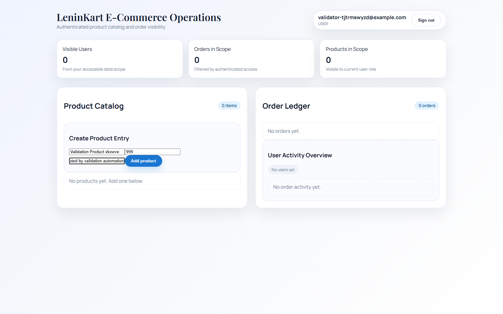
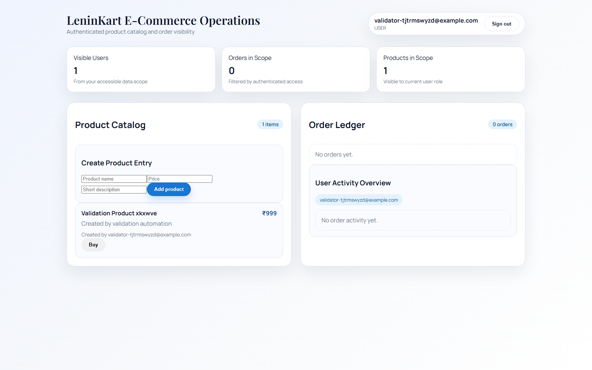
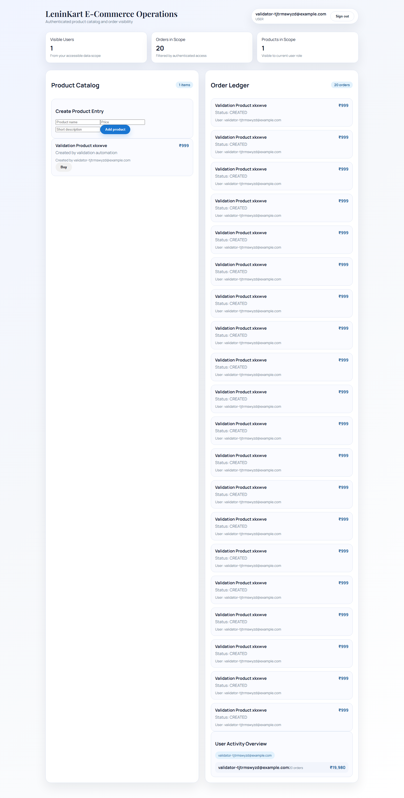

# Application Workflow

This page summarizes the validated LeninKart user workflow that was used to generate business traffic and observability evidence.

- Validation user: `validator-tjtrmswyzd@example.com`
- Product created: `Validation Product xkxwve`
- Orders requested: `20`
- Product visible in UI: `True`
- Order ledger visible: `True`

## Workflow Screenshots

