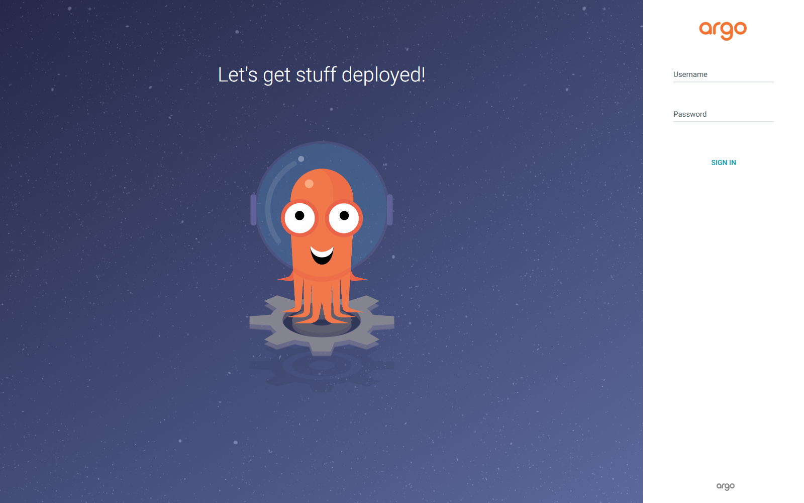
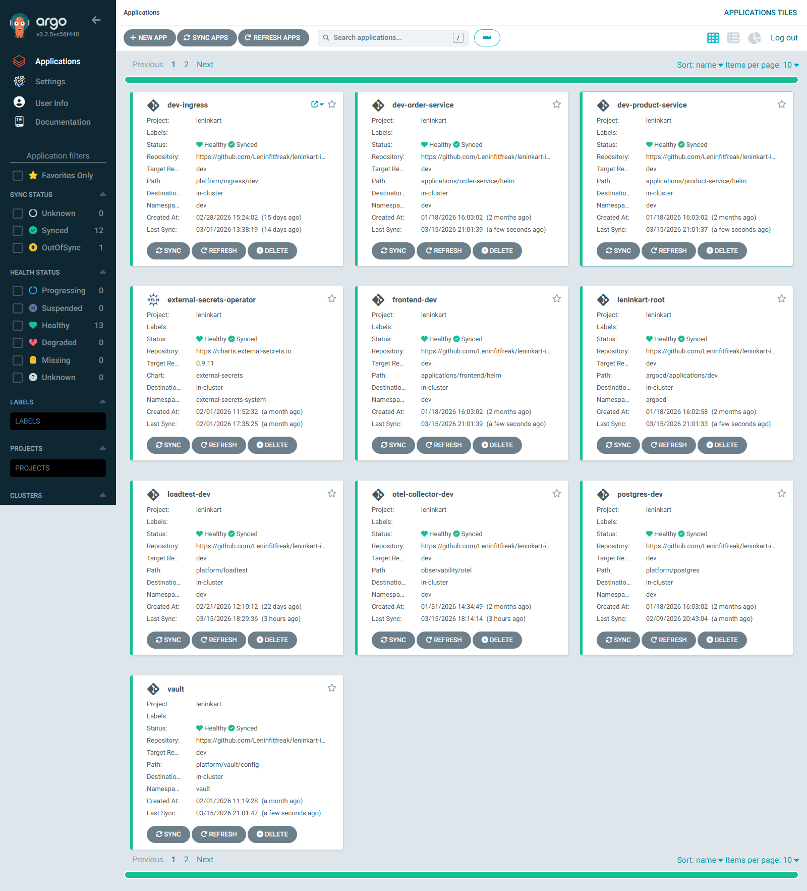
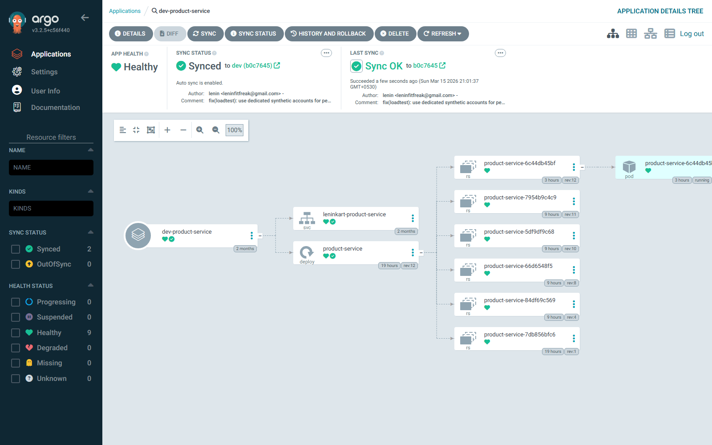
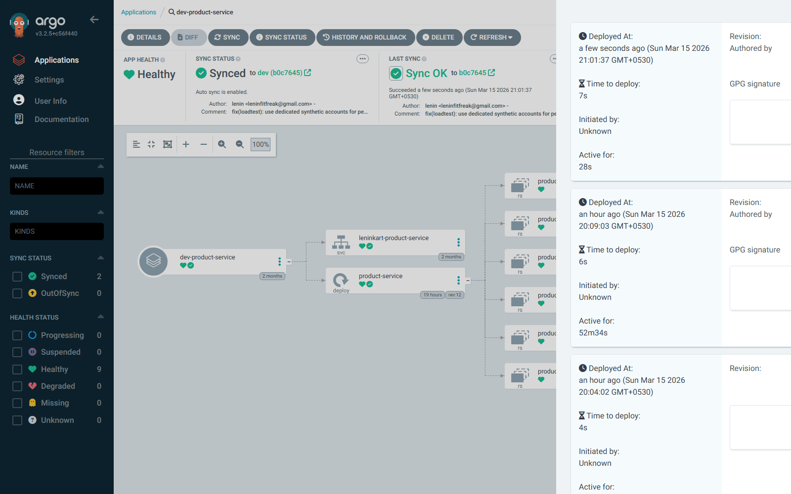

# GitOps Deployment

This report captures the ArgoCD UI evidence used to validate GitOps application inventory, sync state, and revision history.

- Failing core apps observed: `0`

## Explored Pages

### ArgoCD login page
The ArgoCD login page verifies that the GitOps dashboard is reachable and ready for operator access.

### Applications dashboard
The applications dashboard is the GitOps inventory view and shows sync and health state for each managed application.

### Product-service application detail
The product-service application detail page exposes sync state, resource tree, and deployment health for the product API workload.

### Deployment history
The deployment history confirms that GitOps revisions are tracked and rollback-capable through ArgoCD.

