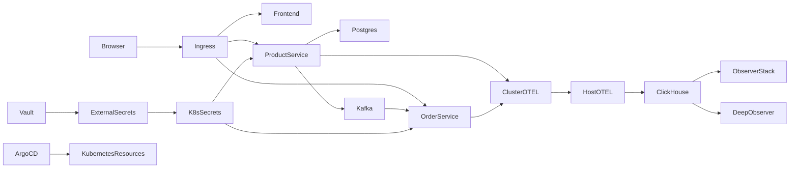
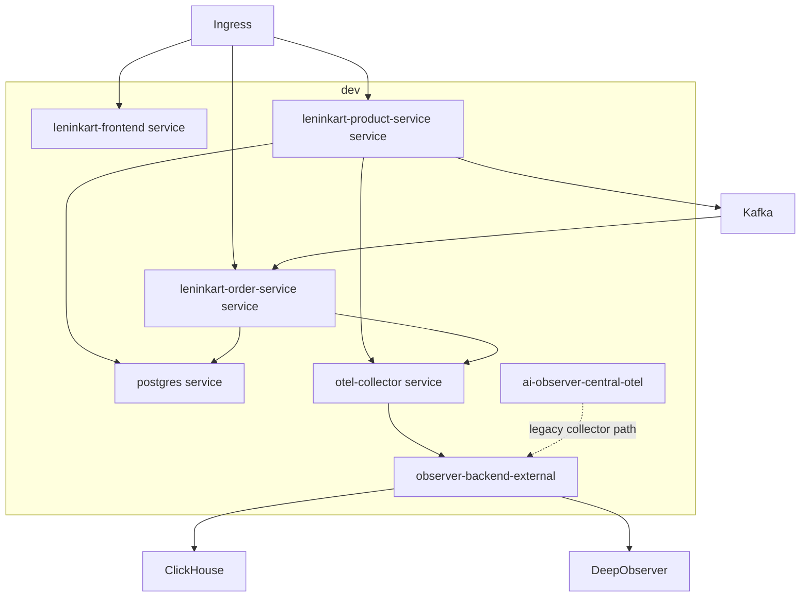
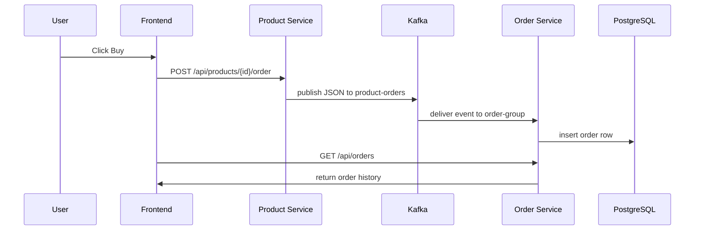
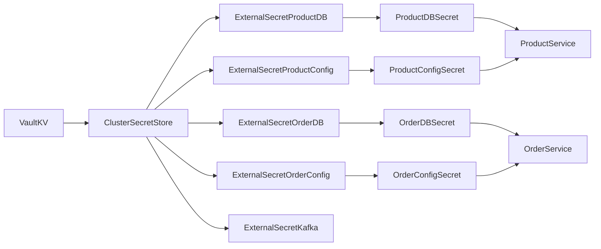

# LeninKart Platform Discovery And End-To-End Test Cases

Last updated: 2026-03-15
Working directory: `C:\Projects\Services\project-validation`

## Purpose

This document captures deep system discovery for the LeninKart platform and defines the end-to-end test cases that should drive future validation and Playwright automation.

Scope of this document:
- system architecture understanding
- frontend element discovery
- backend API discovery
- infrastructure topology discovery
- Kafka event flow discovery
- Vault and External Secrets discovery
- ArgoCD GitOps discovery
- Observer Stack capability discovery
- end-to-end test case design
- screenshot requirements for future automation

This document is based on repository inspection and live runtime discovery from:
- `C:\Projects\infra\leninkart-infra`
- `C:\Projects\Services\observer-stack`
- `C:\Projects\Services\kafka-platform`
- `C:\Projects\Services\leninkart-frontend`
- `C:\Projects\Services\leninkart-product-service`
- `C:\Projects\Services\leninkart-order-service`
- `kubectl`, `docker`, and cluster discovery output collected on 2026-03-15

## 1. System Understanding Model

### 1.1 Platform summary

LeninKart is a local microservices e-commerce platform with Kubernetes-hosted business services and host-side observability and messaging infrastructure.

Business path:
- React frontend is exposed through Kubernetes ingress
- product-service handles signup, login, product listing, product creation, and order initiation
- order-service consumes Kafka order events and serves order history
- PostgreSQL stores products, users, and orders
- Kafka runs outside Kubernetes in Docker Compose and is reached from the cluster via `host.minikube.internal:9092`

Observability path:
- product-service and order-service emit OTLP traces, metrics, and logs
- in-cluster OTEL collector forwards telemetry to host-side Observer Stack OTEL collector
- Observer Stack writes telemetry to ClickHouse
- Observer Stack exposes dashboards, traces, logs, services, messaging queue views, and alerting
- integrated Deep Observer services provide topology analysis and AI reasoning

### 1.2 Runtime topology



### 1.3 Service dependency model

| Layer | Component | Runtime location | Primary responsibility |
|---|---|---|---|
| UI | LeninKart frontend | Kubernetes `dev` namespace | Auth UI, product UI, order UI |
| API | product-service | Kubernetes `dev` namespace | Auth, product CRUD subset, order initiation |
| API | order-service | Kubernetes `dev` namespace | Order ledger retrieval, Kafka consumption |
| Database | PostgreSQL | Kubernetes `dev` namespace | Product, user, and order persistence |
| Messaging | Kafka broker | Docker Compose | Event transport for `product-orders` |
| GitOps | ArgoCD | Kubernetes `argocd` namespace | Deploy and reconcile manifests from Git |
| Secrets | Vault | Kubernetes `vault` namespace | Source of truth for DB and app secrets |
| Secret sync | External Secrets Operator | Kubernetes `external-secrets-system` namespace | Sync Vault data into Kubernetes secrets |
| Observability | Observer Stack | Docker Compose | UI, APIs, OTEL collector, alerts, ClickHouse integration |
| AI | Deep Observer | Docker Compose inside observer-stack | Topology, anomaly detection, RCA |

## 2. Frontend Element Discovery

Source of truth: `C:\Projects\Services\leninkart-frontend\src\index.js`

### 2.1 Frontend structure

The frontend is a single-page React application. It does not use client-side route segmentation for separate pages. Instead, it has two major rendered states:
- unauthenticated auth screen
- authenticated operations dashboard

### 2.2 Unauthenticated UI elements

Primary auth modes:
- login mode
- signup mode

Discovered controls:

| UI area | Element | Behavior |
|---|---|---|
| Auth form | `input[name=fullName]` | Signup only |
| Auth form | `input[name=email]` | Login and signup |
| Auth form | `input[name=password]` | Login and signup |
| Auth form | `input[name=confirmPassword]` | Signup only |
| Auth form | primary submit button | `Create account` in signup mode, `Login` in login mode |
| Auth toggle | toggle button | switches between signup and login mode |
| Messaging | auth error banner | validation or server error feedback |
| Messaging | auth notice banner | signup success feedback |

### 2.3 Authenticated dashboard UI elements

Main dashboard sections:
- top bar with user identity and `Sign out`
- stats cards
- product catalog panel
- order ledger panel
- user activity overview card

Discovered controls:

| Panel | Element | Behavior |
|---|---|---|
| Top bar | `Sign out` | clears auth state |
| Product creation | `input[name=name]` | product name |
| Product creation | `input[name=price]` | product price |
| Product creation | `input[name=description]` | product description |
| Product creation | `Add product` button | sends `POST /api/products` |
| Product card | `Buy` button | sends `POST /api/products/{id}/order` |
| Data loading | periodic polling | orders refresh every 5 seconds |
| User activity | chips and top users list | derived from loaded orders/products |

### 2.4 Frontend API calls

Detected API calls in the SPA:
- `POST /auth/signup`
- `POST /auth/login`
- `GET /api/products`
- `POST /api/products`
- `POST /api/products/{id}/order`
- `GET /api/orders`

Auth token behavior:
- JWT stored in `localStorage` key `lk_token`
- user context stored in `localStorage` key `lk_user`
- outgoing requests add `Authorization: Bearer <token>`

### 2.5 Frontend user workflows

#### Workflow F1: Signup
1. Open LeninKart frontend.
2. Switch auth mode to signup.
3. Enter full name, email, password, confirm password.
4. Submit form.
5. Application sends `POST /auth/signup`.
6. UI shows success notice and returns to login mode.

#### Workflow F2: Login
1. Enter email and password.
2. Submit login form.
3. Application sends `POST /auth/login`.
4. On success, token and user info are persisted.
5. Dashboard loads products and orders.

#### Workflow F3: Create product
1. On dashboard, fill product form.
2. Submit `Add product`.
3. Application sends `POST /api/products`.
4. Product list refreshes.

#### Workflow F4: Create order
1. Click `Buy` on a product card.
2. Application sends `POST /api/products/{id}/order`.
3. Product-service emits Kafka event.
4. Order-service consumes event and persists order.
5. Frontend order poll eventually shows the new order.

#### Workflow F5: View orders
1. Dashboard loads.
2. Frontend calls `GET /api/orders`.
3. Orders list is rendered and refreshed periodically.

## 3. Backend API Discovery

### 3.1 Product-service API

Source files:
- `AuthController.java`
- `ProductController.java`
- `AuthRequest.java`
- `AuthResponse.java`
- `Product.java`
- `ProductRepository.java`

#### Auth endpoints

| Endpoint | Method | Request model | Response model | Behavior |
|---|---|---|---|---|
| `/auth/login` | POST | `{ email?, username?, password }` | `{ token, userId, role }` | authenticates user and returns JWT |
| `/auth/signup` | POST | `{ fullName, email, password }` | `{ token, userId, role }` | creates user and returns auth response |

Observed status behaviors:
- `400` for malformed input
- `401` for bad credentials on login
- `409` for duplicate signup
- `200` for success

#### Product endpoints

| Endpoint | Method | Request model | Response model | Behavior |
|---|---|---|---|---|
| `/api/products` | GET | none | `Product[]` | returns products visible to current user |
| `/api/products` | POST | `Product` body | `Product` | creates product with `createdBy=userId` |
| `/api/products/{id}/order` | POST | none | plain text `order-sent` | emits Kafka event for the selected product |

`Product` model fields:
- `id`
- `name`
- `description`
- `price`
- `createdBy`

Database access patterns:
- `findAllByOrderByIdDesc()` for admin view
- `findAllByCreatedByOrderByIdDesc(userId)` for standard user view
- `save(product)` on product creation
- `findById(id)` before order emit

Kafka producer event contract:
- topic: `product-orders`
- payload shape:
```json
{
  "productId": 1,
  "name": "Example",
  "price": 999.0,
  "user": "user@example.com"
}
```

### 3.2 Order-service API

Source files:
- `OrderController.java`
- `OrderConsumer.java`
- `OrderEntity.java`
- `OrderRepository.java`

#### REST endpoint

| Endpoint | Method | Request model | Response model | Behavior |
|---|---|---|---|---|
| `/api/orders` | GET | none | `OrderEntity[]` | returns orders visible to current user |

`OrderEntity` fields:
- `id`
- `productId`
- `productName`
- `price`
- `status`
- `userName`

Database access patterns:
- `findAllByOrderByIdDesc()` for admin view
- `findAllByUserNameOrderByIdDesc(userName)` for standard user view
- `save(order)` during Kafka consumption

#### Kafka consumer contract

| Topic | Consumer group | Input payload | Persistence effect |
|---|---|---|---|
| `product-orders` | `order-group` | JSON string from product-service | creates `orders` row with status `CREATED` |

Consumer transformation:
- `productId` -> `productId`
- `name` -> `productName`
- `price` -> `price`
- `user` -> `userName`
- hardcoded `status=CREATED`

## 4. Database Interaction Discovery

### 4.1 Product-service database concerns
- stores users for auth workflow
- stores products in table `products`
- uses PostgreSQL at `postgres.dev.svc.cluster.local:5432/leninkart`

### 4.2 Order-service database concerns
- stores orders in table `orders`
- uses PostgreSQL at `postgres.dev.svc.cluster.local:5432/leninkart`

### 4.3 Database validation implications
Future automation should verify:
- user row created after signup
- product row created after product submission
- order row created after Kafka consumption
- user scoping rules for products and orders
- admin vs user view behavior if admin credential exists

## 5. Infrastructure Discovery

### 5.1 Cluster facts

Runtime discovery from `kubectl`:
- Minikube node count: `1`
- node name: `minikube`
- Kubernetes server version: `v1.34.0`
- node internal IP: `192.168.49.2`

Namespaces present:
- `argocd`
- `default`
- `dev`
- `external-secrets-system`
- `ingress-nginx`
- `kube-node-lease`
- `kube-public`
- `kube-system`
- `vault`

### 5.2 Active runtime components

Important services in namespace `dev`:
- `leninkart-frontend`
- `leninkart-product-service`
- `leninkart-order-service`
- `postgres`
- `otel-collector`
- `observer-backend-external`
- `ai-observer-central-otel`

Legacy cluster-side monitoring components may still exist in `dev`, but they are not part of the active target architecture for this validation framework.

Ingress:
- `leninkart-ingress`
- address: `192.168.49.2`
- class: `nginx`

Routing:
- `/` -> frontend
- `/auth` -> product-service
- `/api/products` -> product-service
- `/api/orders` -> order-service

### 5.3 Runtime deployment topology



### 5.4 Infrastructure findings relevant to tests
- completed pods like `loadgen`, `net-debug`, and admission jobs should not be treated as failures
- `vault-secretstores-dev` Argo app remains a drift candidate because it duplicates `vault-secretstore`
- `ai-observer` and `ai-observer-central-collector` are legacy in-cluster components and should be treated separately from the current host-side Observer Stack architecture

## 6. Kafka Messaging Discovery

### 6.1 Kafka runtime model

Kafka is defined in `C:\Projects\Services\kafka-platform\docker-compose.yml`.

Broker details:
- container name: `kafka-platform`
- image: `leninkart/kafka-platform:local`
- ports: `9092`, `7071`
- advertised listener: `PLAINTEXT://host.minikube.internal:9092`
- healthcheck uses `kafka-topics --list`
- JMX exporter runs on `7071`

### 6.2 Topics discovered

From `create-topics.sh`:
- `product-events`
- `order-events`
- `order-created`

From live broker discovery and application behavior:
- `product-orders`

This creates a required validation scenario:
- application runtime depends on `product-orders`
- bootstrap script does not create `product-orders`
- validation must verify the topic exists before testing order creation

### 6.3 Producer and consumer map

| Producer | Topic | Consumer | Outcome |
|---|---|---|---|
| product-service | `product-orders` | order-service | order persisted in PostgreSQL |

### 6.4 Event flow



## 7. Vault And Secret Flow Discovery

### 7.1 Secret store design

Vault is the source of truth. External Secrets Operator maps Vault secrets into Kubernetes secrets using `ClusterSecretStore/vault-backend`.

Cluster secret store config:
- Vault URL: `http://vault.vault.svc.cluster.local:8200`
- engine path: `secret`
- auth method: Kubernetes auth mount `kubernetes`
- Vault role: `leninkart-role`
- service account: `vault-auth`

### 7.2 Verified Vault paths

From infrastructure manifests and migration docs:
- `secret/leninkart/postgres/admin`
- `secret/leninkart/product-service/database`
- `secret/leninkart/product-service/config`
- `secret/leninkart/order-service/database`
- `secret/leninkart/order-service/config`
- `secret/leninkart/kafka/credentials`
- `secret/leninkart/ai-observer/config`

### 7.3 ExternalSecret mappings

| ExternalSecret | Vault path | Target secret | Consuming workload |
|---|---|---|---|
| `product-service-db-creds` | `leninkart/product-service/database` | `product-service-db-secret` | product-service |
| `order-service-db-creds` | `leninkart/order-service/database` | `order-service-db-secret` | order-service |
| `product-service-config` | `leninkart/product-service/config` | `product-service-config-secret` | product-service |
| `order-service-config` | `leninkart/order-service/config` | `order-service-config-secret` | order-service |
| `kafka-creds` | `leninkart/kafka/credentials` | `kafka-secret` | Kafka-related clients |
| `postgres-secret` | `leninkart/postgres/admin` | generated secret | PostgreSQL consumers |
| `ai-observer-secrets` | `leninkart/ai-observer/config` | generated secret | legacy in-cluster ai-observer |

### 7.4 Secret flow diagram



## 8. GitOps Discovery

### 8.1 ArgoCD applications discovered

Dev applications present:
- `dev-ingress`
- `dev-order-service`
- `dev-product-service`
- `external-secrets-operator`
- `frontend-dev`
- `leninkart-root`
- `loadtest-dev`
- `otel-collector-dev`
- `postgres-dev`
- `vault`
- `vault-externalsecrets`
- `vault-secretstore`
- `vault-secretstores-dev`

### 8.2 GitOps behavior

Observed sync policy patterns:
- automated sync enabled on primary workloads
- prune/self-heal enabled on many applications
- retry/backoff configured for Vault-related applications
- `leninkart-root` acts as umbrella application

### 8.3 GitOps validation concerns

Required checks:
- all active child apps are present
- application sync status is `Synced`
- health status is `Healthy` or known acceptable transitional state during rollout
- root app should be observed separately because duplicate child app definitions can leave it `OutOfSync` even when active workloads are healthy

## 9. Observer Stack Discovery

### 9.1 Host-side compose services

From `observer-stack/deploy/docker/docker-compose.yaml`:
- `signoz`
- `signoz-clickhouse`
- `signoz-otel-collector`
- `signoz-telemetrystore-migrator`
- `signoz-alerts-provisioner`
- `signoz-zookeeper-1`
- `deep-observer-postgres`
- `deep-observer-ai-brain`
- `deep-observer-ai-core`
- `deep-observer-frontend`

### 9.2 Telemetry pipeline details

From `otel-collector-config.yaml`:
- OTLP gRPC receiver on `4317`
- OTLP HTTP receiver on `4318`
- internal collector self-scrape for collector metrics
- Kafka metrics scrape from `kafka:7071/metrics`
- Kafka resource enrichment:
  - `service.name=kafka`
  - `messaging.system=kafka`
- exports to ClickHouse logical stores:
  - `signoz_traces`
  - `signoz_metrics`
  - `signoz_logs`
  - `signoz_meter`
  - `signoz_metadata`

### 9.3 Observer Stack capability map

Based on repo docs and frontend route discovery, the platform exposes validation targets for:
- services page
- dashboards page
- traces explorer
- logs explorer
- messaging queues overview
- alerts overview and alert edit routes
- AI Observer integration route
- Deep Observer frontend and API

### 9.4 Observer Stack insights that tests should cover

| Capability | What should be visible |
|---|---|
| Services | service inventory and latency/error views |
| Traces | HTTP spans and Kafka messaging spans |
| Logs | application and collector logs |
| Metrics dashboards | service throughput, error, resource panels |
| Messaging queues | Kafka activity derived from messaging spans |
| Alerts | rules list, channel/routing/planned downtime surfaces |
| AI observer | topology, incidents, root cause reasoning, cluster report |

Important nuance:
- Kafka broker metrics can exist while messaging queue UI is empty if recent Kafka spans are absent
- tests should distinguish metric availability from queue-overview availability

## 10. Full Workflow Discovery

### 10.1 End-to-end business workflow

1. User opens LeninKart via ingress.
2. User signs up or logs in through product-service auth endpoints.
3. Frontend stores JWT and begins loading products and orders.
4. User creates a product through product-service.
5. Product is persisted into PostgreSQL.
6. User clicks `Buy` on a product.
7. Product-service publishes a `product-orders` Kafka event.
8. Order-service consumes the event and inserts an order row into PostgreSQL.
9. Frontend polling on `/api/orders` displays the new order.
10. Product-service and order-service emit telemetry through OTEL.
11. In-cluster OTEL collector forwards telemetry to host-side Observer Stack collector.
12. Observer Stack writes telemetry into ClickHouse.
13. Services, traces, logs, dashboards, and AI views reflect the transaction.

### 10.2 Validation implications

A complete validation run should verify both business correctness and observability side effects:
- user-facing action succeeded
- database state changed correctly
- Kafka message path completed
- traces/logs/metrics were emitted
- dashboards or explorers can show the generated evidence

## 11. Screenshot Requirements For Future Automation

Screenshots that future automation should capture:

| Screenshot ID | Required page or surface | Purpose |
|---|---|---|
| SS-001 | frontend auth page | baseline unauthenticated state |
| SS-002 | signup success state | account creation proof |
| SS-003 | frontend dashboard | authenticated baseline |
| SS-004 | product creation form completed | product creation step evidence |
| SS-005 | product list after creation | product persisted in UI |
| SS-006 | order ledger after buy | order surfaced in UI |
| SS-007 | ArgoCD applications dashboard | GitOps inventory and health |
| SS-008 | ArgoCD app detail for product-service | sync and revision evidence |
| SS-009 | ArgoCD deployment history | release history evidence |
| SS-010 | Vault UI login/home | vault reachable and usable |
| SS-011 | Vault KV path view for product-service config | secret path validation |
| SS-012 | Kubernetes ingress and services evidence | routing proof |
| SS-013 | Kafka topic listing | topic readiness proof |
| SS-014 | Kafka producer/consumer proof | event-path proof |
| SS-015 | Observer Stack services page | service topology evidence |
| SS-016 | Observer Stack traces explorer | trace evidence |
| SS-017 | Observer Stack logs explorer | log evidence |
| SS-018 | Observer Stack dashboards page | dashboard surface proof |
| SS-019 | Kafka telemetry or messaging queues page | Kafka observability proof |
| SS-020 | Observer Stack alerts page | alerting surface proof |
| SS-021 | Deep Observer dashboard | AI observability baseline |
| SS-022 | Deep Observer incident or topology view | AI reasoning surface proof |

## 12. End-To-End Test Cases

### 12.1 Frontend workflow tests

| Test ID | Description | Preconditions | Test steps | Expected result | Related services |
|---|---|---|---|---|---|
| FE-001 | Open LeninKart frontend through ingress | Minikube running, ingress healthy | Open `http://127.0.0.1/` or ingress host | Auth page loads, no network error | frontend, ingress-nginx |
| FE-002 | Signup new user | frontend reachable, product-service reachable | Switch to signup, enter full name/email/password/confirm password, submit | Success notice shown, backend returns success | frontend, product-service, postgres |
| FE-003 | Reject invalid signup | frontend reachable | Try empty fields, invalid email, short password, mismatched confirm password | Client-side validation blocks submission | frontend |
| FE-004 | Login existing user | known user exists | Enter valid email/password, submit | Dashboard loads, token saved in local storage | frontend, product-service |
| FE-005 | Reject invalid login | frontend reachable | Submit invalid credentials | UI shows auth failure | frontend, product-service |
| FE-006 | Session restoration | valid token exists in localStorage | Reload page after successful login | User remains authenticated and dashboard renders | frontend |
| FE-007 | Logout clears session | authenticated session exists | Click `Sign out` | localStorage cleared, auth page shown | frontend |
| FE-008 | Create product from dashboard | authenticated user exists | Fill product name/price/description, click `Add product` | Product appears in catalog | frontend, product-service, postgres |
| FE-009 | Buy product from dashboard | authenticated user exists, at least one product exists | Click `Buy` on product card | Order request accepted and order eventually appears | frontend, product-service, kafka, order-service, postgres |
| FE-010 | Order ledger polling updates | authenticated session exists | Wait for polling cycle after order creation | New order appears without full page refresh | frontend, order-service |
| FE-011 | User-scoped product visibility | two non-admin users exist | Create products under different users, login as each | Standard user sees only own products | frontend, product-service, postgres |
| FE-012 | User-scoped order visibility | two non-admin users exist | Create orders under different users, query as each | Standard user sees only own orders | frontend, order-service, postgres |

### 12.2 API contract tests

| Test ID | Description | Preconditions | Test steps | Expected result | Related services |
|---|---|---|---|---|---|
| API-001 | `POST /auth/signup` valid payload | service healthy | Submit `{fullName,email,password}` | `200` with `token`, `userId`, `role` | product-service |
| API-002 | `POST /auth/signup` duplicate user | seeded user exists | Submit same email twice | `409 Conflict` | product-service, postgres |
| API-003 | `POST /auth/login` valid credentials | user exists | Submit valid email/password | `200` with JWT | product-service |
| API-004 | `POST /auth/login` invalid credentials | service healthy | Submit bad password | `401 Unauthorized` | product-service |
| API-005 | `GET /api/products` unauthorized | no auth header | Call endpoint directly | request rejected by auth middleware or empty/unauthorized behavior per runtime | product-service |
| API-006 | `GET /api/products` authorized | valid JWT exists | Call endpoint with Bearer token | product list returned | product-service |
| API-007 | `POST /api/products` valid payload | valid JWT exists | Submit product JSON | persisted product returned with `createdBy=userId` | product-service, postgres |
| API-008 | `POST /api/products/{id}/order` valid ID | product exists, valid JWT exists | Call order endpoint | `200` with `order-sent` | product-service, kafka |
| API-009 | `POST /api/products/{id}/order` invalid ID | valid JWT exists | Call endpoint with missing product ID | `404` | product-service |
| API-010 | `GET /api/orders` authorized | valid JWT exists | Call endpoint | matching order rows returned | order-service, postgres |

### 12.3 Kafka and event flow tests

| Test ID | Description | Preconditions | Test steps | Expected result | Related services |
|---|---|---|---|---|---|
| MQ-001 | Kafka container is running | docker available | Inspect `kafka-platform` container | container running | kafka-platform |
| MQ-002 | Required topics exist | broker reachable | List topics with Kafka CLI | `product-orders`, `product-events`, `order-events`, `order-created` exist | kafka-platform |
| MQ-003 | App can produce `product-orders` event | valid product and JWT exist | Call order endpoint | broker receives message on `product-orders` | product-service, kafka |
| MQ-004 | Order-service consumes `product-orders` | MQ-003 completed | Check order-service logs or resulting order row | consumer processes event and saves order | order-service, kafka, postgres |
| MQ-005 | Probe producer/consumer round trip | broker reachable | Produce message to validation topic and consume it | same message is read back | kafka-platform |
| MQ-006 | Kafka JMX metrics exposed | broker running | Query `http://localhost:7071/metrics` | exporter metrics payload returned | kafka-platform, observer-stack |
| MQ-007 | Topic bootstrap mismatch detection | broker reachable | Compare `create-topics.sh` topics against live topics and app dependencies | mismatch with `product-orders` is documented and handled | kafka-platform, product-service, order-service |

### 12.4 Database validation tests

| Test ID | Description | Preconditions | Test steps | Expected result | Related services |
|---|---|---|---|---|---|
| DB-001 | Signup persists user | valid signup payload | Run signup, inspect user table or successful login | user record exists | product-service, postgres |
| DB-002 | Product creation persists product | authenticated user exists | Create product, inspect `products` table or API response | new product row exists with `createdBy` | product-service, postgres |
| DB-003 | Order event persists order | order event emitted | inspect `orders` table or `GET /api/orders` | new order row exists with `status=CREATED` | order-service, postgres |
| DB-004 | Ordering is descending by ID | multiple rows exist | query products/orders via API | latest rows appear first | product-service, order-service, postgres |

### 12.5 Infrastructure validation tests

| Test ID | Description | Preconditions | Test steps | Expected result | Related services |
|---|---|---|---|---|---|
| INF-001 | Kubernetes node healthy | minikube started | `kubectl get nodes -o wide` | `minikube` is `Ready` | kubernetes |
| INF-002 | Required namespaces present | cluster reachable | `kubectl get ns` | `argocd`, `dev`, `vault`, `external-secrets-system`, `ingress-nginx` present | kubernetes |
| INF-003 | Business pods healthy | cluster reachable | `kubectl get pods -n dev` | frontend, product-service, order-service, postgres, otel-collector running | kubernetes |
| INF-004 | Required services exposed | cluster reachable | `kubectl get svc -A` | frontend, product, order, postgres, otel-collector services present | kubernetes |
| INF-005 | Ingress routing configured | cluster reachable | `kubectl get ingress -A` and inspect ingress YAML | expected four paths exist | ingress-nginx, frontend, product-service, order-service |
| INF-006 | No unexpected workload regressions | cluster reachable | verify no critical pod in `CrashLoopBackOff`, `ImagePullBackOff`, or `Pending` among active target workloads | active business workloads healthy | kubernetes |

### 12.6 Vault and secret access tests

| Test ID | Description | Preconditions | Test steps | Expected result | Related services |
|---|---|---|---|---|---|
| SEC-001 | Vault pod ready | cluster reachable | `kubectl get pods -n vault` | `vault-0` ready | vault |
| SEC-002 | Vault unsealed | vault reachable | run `vault status` inside pod | `Sealed=false` | vault |
| SEC-003 | ClusterSecretStore valid | ESO installed | inspect `vault-backend` store | store is valid and ready | vault, external-secrets |
| SEC-004 | ExternalSecrets synced | Vault healthy | `kubectl get externalsecret -A` | required secrets show `READY=True` | vault, external-secrets |
| SEC-005 | Product-service secret mapping | ExternalSecrets synced | inspect generated secret env mapping | `APP_JWT_SECRET` and DB creds available to workload | vault, external-secrets, product-service |
| SEC-006 | Order-service secret mapping | ExternalSecrets synced | inspect generated secret env mapping | `APP_JWT_SECRET` and DB creds available to workload | vault, external-secrets, order-service |
| SEC-007 | Kafka secret path available | Vault healthy | verify `kafka-creds` ExternalSecret sync | Kafka credential path resolves successfully | vault, external-secrets |

### 12.7 GitOps validation tests

| Test ID | Description | Preconditions | Test steps | Expected result | Related services |
|---|---|---|---|---|---|
| GIT-001 | ArgoCD server reachable | ArgoCD running | open ArgoCD UI or query service | dashboard accessible | argocd |
| GIT-002 | Required apps exist | cluster reachable | `kubectl get applications.argoproj.io -A` | all core apps listed | argocd |
| GIT-003 | Core apps synced and healthy | ArgoCD reachable | inspect core dev apps | product, order, frontend, ingress, postgres, vault, ESO apps are `Synced` and `Healthy` | argocd |
| GIT-004 | Root app health observed | ArgoCD reachable | inspect `leninkart-root` | root app status documented; drift does not mask child-app health | argocd |
| GIT-005 | Deployment history exists | ArgoCD UI/API reachable | inspect app history for product-service and order-service | revision history visible | argocd |

### 12.8 Observability validation tests

| Test ID | Description | Preconditions | Test steps | Expected result | Related services |
|---|---|---|---|---|---|
| OBS-001 | Grafana UI reachable and login screen available | Grafana port-forward active | open `http://127.0.0.1:3000/login` | Grafana login loads | grafana |
| OBS-002 | Grafana admin credentials available from cluster-managed secret | cluster reachable | inspect `grafana-admin-secret` in namespace `dev` | admin user/password can be resolved without Git-stored secrets | grafana, kubernetes |
| OBS-003 | Prometheus UI reachable | Prometheus port-forward active | open `http://127.0.0.1:9090/targets` | Prometheus targets page loads | prometheus |
| OBS-004 | Prometheus targets healthy for key workloads | recent scrapes exist | inspect `/api/v1/targets` or `/targets` | `product-service`, `order-service`, `kafka-platform`, and `prometheus` are up | prometheus, kafka |
| OBS-005 | Distributed tracing is explicitly deferred | docs available | inspect tracing decision document | tracing state is documented as deferred or removed from active expectations | docs, observability |
| OBS-006 | Loki-backed backend logs visible | recent traffic exists | query Loki or open Grafana logs dashboard | product-service/order-service logs are visible | loki, grafana |
| OBS-007 | LeninKart Grafana dashboards render | recent traffic exists | open dashboard list and curated dashboards | LeninKart dashboards load with visible panels | grafana, prometheus |
| OBS-008 | Kafka observability remains metrics-based | recent Kafka traffic exists | inspect Kafka overview dashboard and Prometheus metrics | broker availability and traffic metrics are visible without requiring tracing-only queue views | grafana, prometheus, kafka |
| OBS-009 | Grafana alerting surfaces remain accessible | Grafana healthy | open alerting section or query Grafana API health | alerting UI/API reachable | grafana |
| OBS-010 | Grafana/Loki/Prometheus provisioning is Git-tracked | repo available | inspect observability bootstrap and infra values | provisioning remains automated and reproducible from Git | grafana, prometheus, loki |

### 12.9 AI observability validation tests

| Test ID | Description | Preconditions | Test steps | Expected result | Related services |
|---|---|---|---|---|---|
| AI-001 | Deep Observer services healthy | compose running | inspect Docker containers and `/health` | ai-core, ai-brain, frontend, postgres running | deep-observer |
| AI-002 | Topology view available | telemetry exists | open Deep Observer UI | topology graph or dashboard renders | deep-observer, clickhouse |
| AI-003 | Incident list available | AI pipeline active | inspect incident view/API | incident endpoint responds | deep-observer |
| AI-004 | RCA workflow surface available | incident or topology data exists | inspect reasoning panel / incident details | reasoning UI present and responsive | deep-observer |
| AI-005 | Telemetry dependency extraction | recent traces and Kafka spans exist | compare Deep Observer topology with system workflow | HTTP, Kafka, and database edges inferred correctly | deep-observer, observer-stack |


### 12.10 OpenTelemetry pipeline validation tests

| Test ID | Description | Preconditions | Test steps | Expected result | Related services |
|---|---|---|---|---|---|
| OTEL-001 | Legacy OTel collector expectations are retired from active validation | current observability stack uses Prometheus/Grafana/Loki | inspect validation engine module list | OTel pipeline tests are not treated as active pass/fail gates | project-validation |
| OTEL-002 | Java services do not claim active trace backend support | repo and manifests available | inspect service Dockerfiles and deployment env | any remaining OTel remnants are documented as deferred, not as supported runtime tracing | product-service, order-service, docs |
| OTEL-003 | Trace-dependent UI checks are not required for success | validation docs available | inspect observability test catalog | no active validation requires SigNoz/ClickHouse trace views | project-validation |
| OTEL-004 | Future trace enablement remains optional | instrumentation plan available | inspect instrumentation plan | trace work is documented as a future decision, not as a blocker | docs |
| OTEL-005 | Current observability remains metrics-and-logs first | current stack healthy | inspect Grafana dashboards and Loki visibility | metrics and logs validation passes without trace backend dependency | grafana, loki, prometheus |

### 12.11 ClickHouse telemetry database validation tests

| Test ID | Description | Preconditions | Test steps | Expected result | Related services |
|---|---|---|---|---|---|
| CH-001 | ClickHouse is not part of the supported observability runtime | current stack uses Prometheus/Grafana/Loki | inspect observability architecture docs | ClickHouse is absent from active runtime expectations | docs |
| CH-002 | ClickHouse checks are retired from active validation | validation engine available | inspect active module list | no ClickHouse validation module runs as a required gate | project-validation |
| CH-003 | Metrics storage is Prometheus-native | Prometheus healthy | inspect Prometheus targets and queries | metrics are validated via Prometheus instead of ClickHouse tables | prometheus |
| CH-004 | Logs storage is Loki-native | Loki healthy | inspect Loki queries | logs are validated via Loki instead of ClickHouse-backed log tables | loki |
| CH-005 | Dashboards query Grafana datasources, not ClickHouse tables | Grafana dashboards provisioned | inspect dashboard datasource configuration | Grafana dashboards use Prometheus/Loki datasources | grafana |
| CH-006 | Traffic validation no longer depends on ClickHouse row counts | frontend traffic generated | inspect Grafana dashboards and Loki/Prometheus APIs | telemetry visibility is validated without ClickHouse-specific queries | grafana, loki, prometheus |

### 12.12 External service connectivity validation tests

| Test ID | Description | Preconditions | Test steps | Expected result | Related services |
|---|---|---|---|---|---|
| EXT-001 | Product-service reaches PostgreSQL | product-service running | inspect readiness/logs and perform create-product flow | no datasource connection errors, writes succeed | product-service, postgres |
| EXT-002 | Order-service reaches PostgreSQL | order-service running | create order, inspect persistence | order write succeeds without DB connection errors | order-service, postgres |
| EXT-003 | Product-service reaches Kafka | product-service running | place order and inspect Kafka topic delta | producer publishes successfully | product-service, kafka |
| EXT-004 | In-cluster collector reaches host OTEL collector | collectors running | inspect collector config and emit traffic | host-side collector receives traffic from cluster | otel, observer-stack |
| EXT-005 | Business services reachable through ingress | ingress running | open `/`, `/auth`, `/api/products`, `/api/orders` via ingress | all expected routes resolve correctly | ingress, frontend, product-service, order-service |

### 12.13 Frontend performance validation tests

| Test ID | Description | Preconditions | Test steps | Expected result | Related services |
|---|---|---|---|---|---|
| PERF-001 | Auth page baseline load | frontend reachable | open frontend with Playwright and measure first render/navigation time | auth page renders within acceptable local-dev threshold | frontend |
| PERF-002 | Dashboard load after login | valid user exists | login and measure dashboard render after auth submit | dashboard becomes interactive within acceptable local-dev threshold | frontend, product-service, order-service |
| PERF-003 | Product creation latency | authenticated user exists | submit product form and measure response/update time | product appears without excessive delay | frontend, product-service, postgres |
| PERF-004 | Order ledger update latency | authenticated user exists and Kafka healthy | place order and measure until order appears in ledger | ledger updates within expected async processing window | frontend, product-service, kafka, order-service |

### 12.14 Kafka telemetry verification tests

| Test ID | Description | Preconditions | Test steps | Expected result | Related services |
|---|---|---|---|---|---|
| KTEL-001 | Kafka JMX endpoint reachable | broker running | query `http://localhost:7071/metrics` | exporter responds with broker metrics | kafka-platform |
| KTEL-002 | Observer Stack collector scrapes Kafka metrics | observer stack collector running | inspect collector config and telemetry ingestion state | Kafka metrics are present in the metrics backend | observer-stack, kafka, clickhouse |
| KTEL-003 | Kafka service appears in Observer Stack metrics context | recent metrics ingested | inspect services or metrics explorer | Kafka is visible as `service.name=kafka` or equivalent metric resource | observer-stack |
| KTEL-004 | Messaging queue view behavior matches span availability | recent order traffic generated | inspect messaging queues page after traffic | queue view shows Kafka data if messaging spans are present; otherwise empty state is documented as telemetry gap | observer-stack, kafka |
## 13. Automation Design Notes

This test-case set is intended to drive future Playwright and API automation. The automation layer should be organized into these groups:
- frontend workflows
- API contract tests
- Kafka broker and topic tests
- database and persistence assertions
- Vault and ExternalSecret health tests
- ArgoCD and GitOps convergence tests
- observability UI evidence tests
- AI observability UI and API tests

Key implementation constraints for future automation:
- frontend test users should be generated dynamically to avoid signup collisions
- order validation should wait for asynchronous Kafka consumption
- observability tests should generate traffic first, then inspect traces/logs/metrics
- messaging queue tests must account for time-window sensitivity
- Argo root-app drift should not be treated the same as child-app deployment failure
- Vault and ExternalSecrets should be validated before application rollout assertions

## 14. Conclusion

The platform is sufficiently understood to support a robust validation suite.

Minimum end-to-end validation chain that future automation must always cover:
1. cluster and GitOps healthy
2. Vault and ExternalSecrets healthy
3. frontend reachable
4. signup/login works
5. product creation works
6. order submission works
7. Kafka message path completes
8. order appears in ledger
9. traces/logs/metrics are emitted
10. Observer Stack surfaces the transaction
11. AI observability surfaces are reachable


### 12.15 Validated UI evidence tests

| Test ID | Description | Preconditions | Test steps | Expected result | Related services |
|---|---|---|---|---|---|
| UI-001 | Frontend screenshots captured only after valid authenticated state | frontend reachable, Playwright automation available | open auth and dashboard flows, validate required fields and data before capture | screenshots never show blank page, login error page, spinner-only state, or empty order result when success is expected | frontend, product-service, order-service |
| UI-002 | ArgoCD screenshots captured only after successful login and application data render | ArgoCD reachable | login, wait for applications table and target app content, then capture | screenshots show real application state and deployment history, not the login form or loading shell | argocd |
| UI-003 | Vault screenshots captured only after token auth and KV data render | Vault reachable, root token available | open login page, authenticate, navigate to KV path, verify listed entries before capture | screenshots show valid login or secret content state, not blank or error page | vault |
| UI-004 | Observer Stack screenshots captured only after telemetry-bearing views load | Observer Stack reachable, recent traffic generated | navigate services, traces, logs, dashboards, messaging views and verify non-empty content before capture | screenshots show real telemetry-backed UI state | observer-stack, clickhouse, otel |
| UI-005 | Deep Observer screenshots captured only after topology or incident data is rendered | Deep Observer reachable | open topology and incidents pages, verify content is present, then capture | screenshots show topology/incident state, not empty shell or error panel | deep-observer |
| UI-006 | Screenshot rejection and retry logic works | automation engine available | force or detect invalid page state, retry navigation/workflow until valid content appears | invalid screenshots are discarded and replaced by validated evidence | validation-engine |


### 12.16 Additional strict runtime validations

| Test ID | Description | Preconditions | Test steps | Expected result | Related services |
|---|---|---|---|---|---|
| MQ-008 | Kafka message flow after high-volume UI traffic | frontend and kafka healthy | run repeated UI order flow, inspect broker topic, database rows, and order ledger | message flow is proven end to end from UI to Kafka to order-service persistence | frontend, product-service, kafka, order-service, postgres |
| OBS-011 | Telemetry validation after repeated traffic | observer stack healthy | generate repeated UI traffic, verify traces, logs, metrics, and AI incidents are refreshed | telemetry-backed pages show populated evidence after traffic generation | observer-stack, clickhouse, otel, deep-observer |
| SEC-008 | Vault secret value validation | vault healthy and root token available | read representative secret path, verify required keys and values are retrievable, capture evidence | key-value pairs for product-service config are verified during the run | vault |
